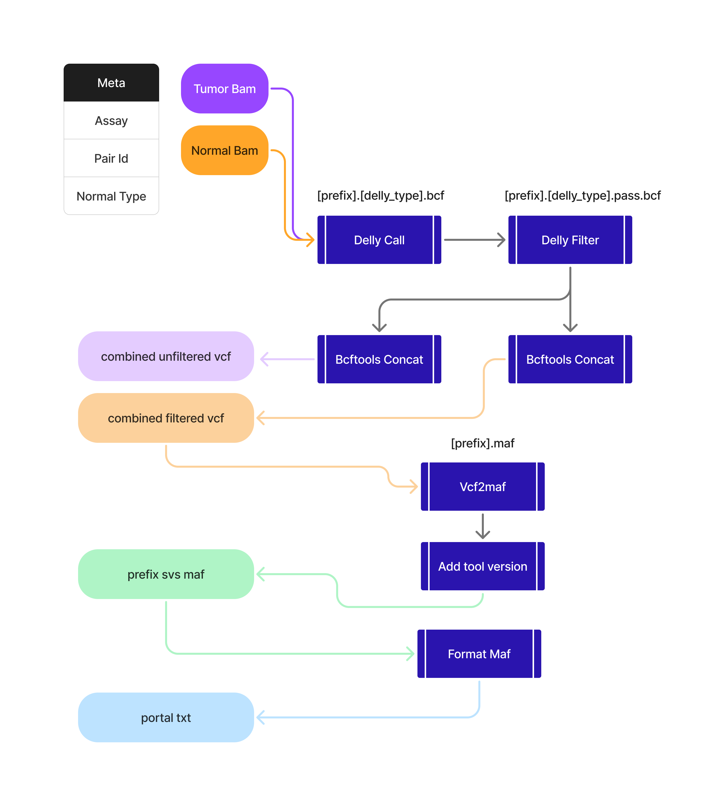

[](https://github.com/mskcc/sif/actions?query=workflow%3A%22nf-core+CI%22)
[](https://github.com/mskcc/sif/actions?query=workflow%3A%22nf-core+linting%22)[](https://doi.org/10.5281/zenodo.XXXXXXX)

[](https://www.nextflow.io/)
[](https://docs.conda.io/en/latest/)
[](https://www.docker.com/)
[](https://sylabs.io/docs/)
[](https://tower.nf/launch?pipeline=https://github.com/mskcc/sif)

## Introduction

**mskcc/sif** is a bioinformatics pipeline that calculates the structural variants mutations from a Tumor/Normal Bam pair.



1. Calculate SV variants ([`Delly`](https://github.com/dellytools/delly/releases/tag/v1.2.6))
2. Filter SV variants ([`Delly`](https://github.com/dellytools/delly/releases/tag/v1.2.6))
3. Concat variants ([`bcftools`](https://github.com/samtools/bcftools/tree/1.9))
4. Convert to maf ([`vcf2maf`](https://github.com/mskcc/vcf2maf/releases/tag/v1.6.17))
5. Generate portal file ([`format_maf`](modules/local/format-maf/resources/usr/bin/format_maf.sh))

## Usage

> [!NOTE]
> If you are new to Nextflow and nf-core, please refer to [this page](https://nf-co.re/docs/usage/installation) on how to set-up Nextflow. Make sure to [test your setup](https://nf-co.re/docs/usage/introduction#how-to-run-a-pipeline) with `-profile test` before running the workflow on actual data.

First, prepare a samplesheet with your input data that looks as follows:

`samplesheet.csv`:

```csv
pairId,tumorBam,normalBam,assay,normalType,bedFile
pair_sample,/bam/path/foo_tumor.rg.md.abra.printreads.bam,/bam/path/foo_normal.rg.md.abra.printreads.bam,IMPACT505,MATCHED,NONE
```

> [!IMPORTANT]
> Make sure the bams have an index file associated with it either file.bam.bai or file.bai should work

Now, you can run the pipeline using:

```bash
nextflow run main.nf \
   -profile singularity,test_juno \
   --input samplesheet.csv \
   --outdir <OUTDIR>
```

> [!WARNING]
> Please provide pipeline parameters via the CLI or Nextflow `-params-file` option. Custom config files including those provided by the `-c` Nextflow option can be used to provide any configuration _**except for parameters**_; see [docs](https://nf-co.re/usage/configuration#custom-configuration-files).

## Credits

mskcc/sif was originally written by Nikhil Kumar [@nikhil](https://github.com/nikhil).

<!--We thank the following people for their extensive assistance in the development of this pipeline: -->

<!-- TODO nf-core: If applicable, make list of people who have also contributed -->

## Contributions and Support

If you would like to contribute to this pipeline, please see the [contributing guidelines](.github/CONTRIBUTING.md).

## Citations

<!-- TODO nf-core: Add citation for pipeline after first release. Uncomment lines below and update Zenodo doi and badge at the top of this file. -->
<!-- If you use  mskcc/sif for your analysis, please cite it using the following doi: [10.5281/zenodo.XXXXXX](https://doi.org/10.5281/zenodo.XXXXXX) -->

<!-- TODO nf-core: Add bibliography of tools and data used in your pipeline -->

An extensive list of references for the tools used by the pipeline can be found in the [`CITATIONS.md`](CITATIONS.md) file.

This pipeline uses code and infrastructure developed and maintained by the [nf-core](https://nf-co.re) community, reused here under the [MIT license](https://github.com/nf-core/tools/blob/master/LICENSE).

> **The nf-core framework for community-curated bioinformatics pipelines.**
>
> Philip Ewels, Alexander Peltzer, Sven Fillinger, Harshil Patel, Johannes Alneberg, Andreas Wilm, Maxime Ulysse Garcia, Paolo Di Tommaso & Sven Nahnsen.
>
> _Nat Biotechnol._ 2020 Feb 13. doi: [10.1038/s41587-020-0439-x](https://dx.doi.org/10.1038/s41587-020-0439-x).
